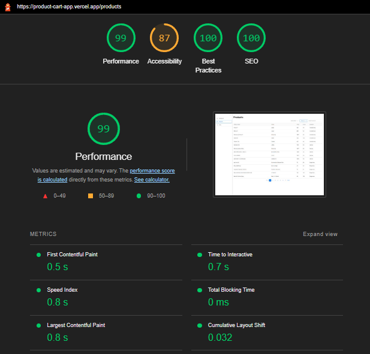

# Product Cart App

E commerce product and cart dashboard app using [DummyJSON](https://dummyjson.com/) REST API

Features:

- Number of items per brand chart
- Product list page with filters and search
- Cart list page with pagination
- Cart detail page
- Local storage & data caching with SWR

## Preview

Live Site URL: [Preview](https://product-cart-app.vercel.app/)

## Getting Started

First, install the dependencies:

```bash
npm install
# or
yarn install
```

run the development server

```bash
npm run dev
# or
yarn dev
```

Open [http://localhost:3000](http://localhost:3000) with your browser to see the result.

## Built with

- Typescript
- Framework: NextJs, React
- UI Library: Emotion, Geist UI, ChartJS
- Fetching Library: SWR

## Lighthouse



## Author

- Website - [Fauzan Rianda](https://fauzanr.github.io)
- Linkedin - [Fauzan Rianda](https://www.linkedin.com/in/fauzanr/)
